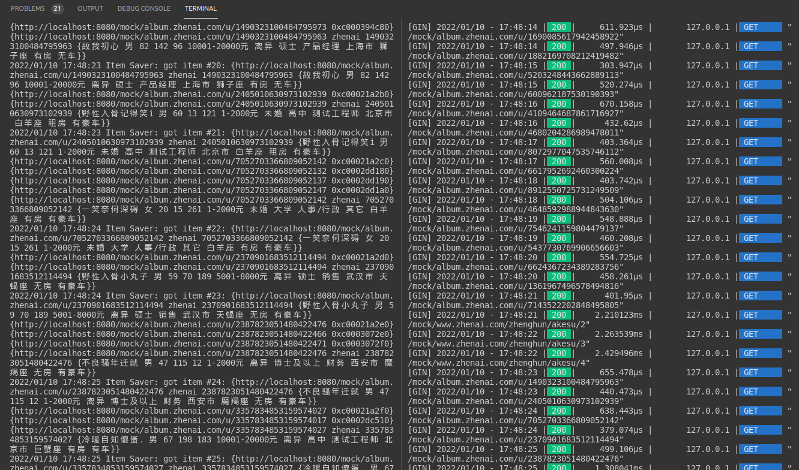
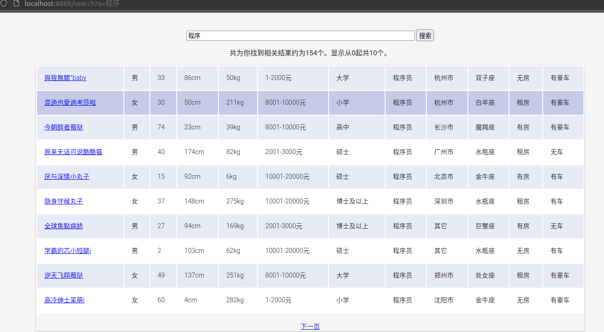
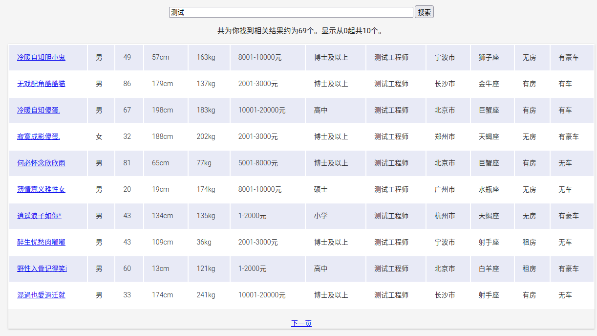

# Go实现并发分布式版本爬虫  

## 技术栈  

- 使用ElasticSearch作为数据存储  
- 使用Go语言标准模板库实现http数据展示部分  

## Docker安装  

```
$ docker run -d -p 80:80 nginx

$ docker run -d -p 9200:9200 -p 9300:9300 elasticsearch
(docker run -p 127.0.0.1:9200:9200 -p 127.0.0.1:9300:9300 -e "discovery.type=single-node" docker.elastic.co/elasticsearch/elasticsearch:7.16.2)
```

## 运行并发版爬虫  

1，确保本地运行了elasticsearch服务，通过`127.0.0.1:9200`验证  

2，`go run mockserver/main.go`，运行模拟珍爱网的服务  

3，`go run main.go`，运行并发版爬虫main函数  

4，`go run frontend/starter.go`，运行本地展现爬虫结果的前端  

实现效果：  

  

  

  

  

## 运行分布式版爬虫  

待更新

