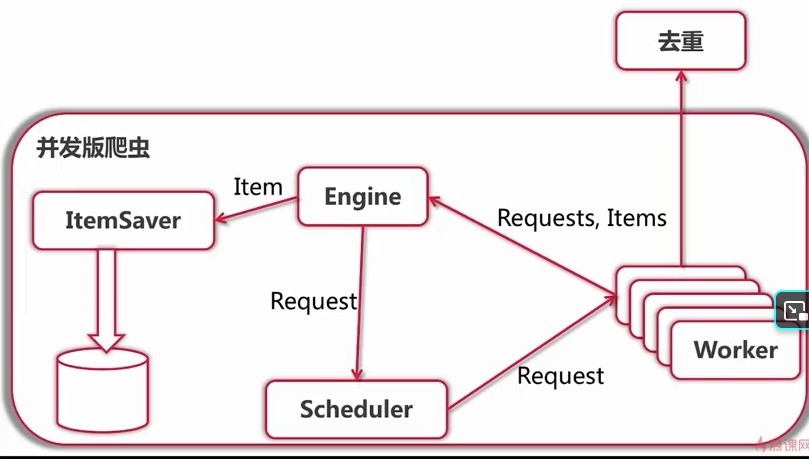

<!--
 * @Description: 
 * @Author: neozhang
 * @Date: 2022-01-10 18:10:11
 * @LastEditors: neozhang
 * @LastEditTime: 2022-01-10 18:16:07
-->
# 目前的问题  

## 限流问题  

问题：单节点能够承受的流量有限  
解决：将Worker放到不同的节点  

  

## 去重问题  

问题1：单节点能承受的去重数据量有限  

  

问题2：无法保存之前的去重结果  

  

## 数据存储问题  

问题：存储部分的结构，技术栈和爬虫部分区别很大  
解决：进一步优化需要特殊的ES技术背景  

固有分布式  